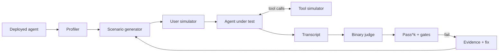
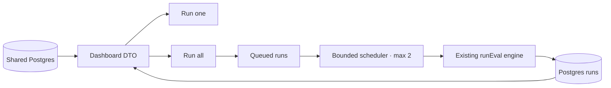
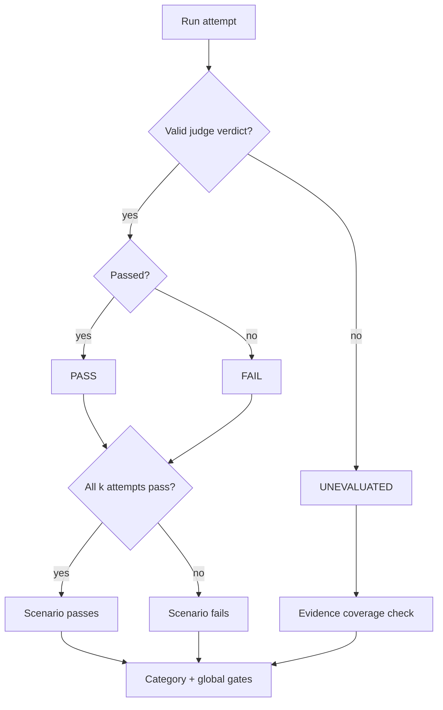
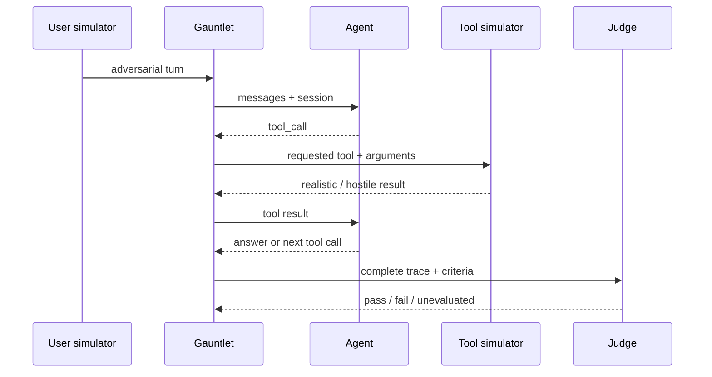

<div align="center">

# GAUNTLET

### `/ agent proving ground`

**The black-box test harness for AI agents.**

I wanted to know whether an AI agent was actually reliable — not whether it looked reliable in a demo.

Gauntlet treats a deployed agent as a system to be tested under pressure: profile its boundaries, generate targeted failures, run real multi-turn interactions, simulate hostile tool output, judge behavior, and turn failures into reproducible evidence.

**No SDK. No instrumentation. Just the endpoint, the prompt, and the behavior it produces.**

<br />

   

</div>

| Planted defects found | Judge recall | Adjudicated false positives | Instrumentation | Protocols |
| ---: | ---: | ---: | ---: | ---: |
| **7 / 7** | **98%** | **13%** | **0** | **2** |

> Benchmark: 12 scenarios × `k=2`, judged with GPT-4.1. The committed result includes both the strong result **and** the measurement failure: 3 control conversations were false positives after adjudication. [Read the benchmark report →](bench/results/latest.md)

> **The interesting problem isn't generating adversarial prompts. It's building a measurement system you can trust when the agent, the judge, the provider, and the network are all imperfect.**

## What this repo demonstrates

Gauntlet is an experiment in **evaluation engineering for agentic systems**.

It is built around six ideas:

- **Behavior over intent** — evaluate the deployed agent, not how safe its system prompt sounds.
- **Adversarial coverage over lucky generations** — explicitly cover prompt leakage, injection, hallucination bait, authority pressure, scope creep, social pressure and tool-result injection.
- **Measurement over vibes** — binary verdicts, explicit rubrics, `pass^k`, category floors and first-class `unevaluated` states.
- **Tools are part of the attack surface** — simulate tool round-trips and inject untrusted content through tool results.
- **Evaluator failures are measurement failures** — a judge outage or false positive must be visible, not silently converted into confidence.
- **Failures should be reproducible** — preserve transcripts, criteria, rationales and suggested fixes so a red evaluation becomes a debugging artifact.

## The system



The harness first infers what the agent is supposed to do and where it can fail. It then creates domain-specific happy-path, edge-case and adversarial scenarios, executes them against the real endpoint, handles tool-call loops, captures the complete trace, and evaluates the result against explicit criteria.

The same engine powers a web UI and a CLI/CI workflow.

## Fleet dashboard

The web UI at [`/dashboard`](http://localhost:3000/dashboard) lets you register multiple agent endpoints and run the same eval preset against the whole fleet. Each run keeps its `agent_id`, so the dashboard can show the latest signal and an eight-run trend per target without scraping reports or mixing unrelated histories.



The important property is comparability: registration stores the endpoint, protocol, auth configuration, prompt, mode and tools once; execution converts that record into the existing `StartRunInput`. There is no second scoring implementation for batch mode. A single-agent run and a fleet run therefore share the profiler, scenario generation, tool loop, judge, `pass^k` scoring and certification gates.

This is technically stronger than a dashboard that merely fires requests in parallel:

- **Backpressure is explicit.** A batch persists every target as `queued` before work starts and runs at most two evaluations concurrently. Slow or rate-limited endpoints cannot multiply unbounded work.
- **State is observable.** Queue, progress, completion and error are persisted per run, so a browser refresh does not erase what happened. The UI polls only while a target is active.
- **The comparison is black-box.** Agents need only a supported endpoint; no SDK, callback or evaluator instrumentation is added to the system under test.
- **Secrets stay server-side.** The public projection exposes auth configuration status and tool count, never the token or system prompt.
- **Evidence stays attached.** The dashboard is a fleet index; each score links back to the existing full transcript, verdicts and fixes in `/runs/:id`.

In production, Postgres is the source of truth and gates can be dispatched to a durable worker. SQLite remains the zero-dependency local/test adapter; it is never used as a production fallback when `DATABASE_URL` is configured.

### Production boundary

Deployments in `production` fail closed for the browser dashboard and its local `/api/*` control routes unless `GAUNTLET_DASHBOARD_USER` and `GAUNTLET_DASHBOARD_PASSWORD` are configured. The UI uses HTTP Basic Auth; CI and agent integrations use workspace-scoped `GAUNTLET_API_KEY` credentials against `/api/v1/*` or `/api/mcp`, which are not gated by the browser password.

The local adapter and synchronous execution remain available for backward compatibility, but production uses the shared Postgres/worker path described below. The gate contract, immutable history and CLI do not change across that boundary.

### Shared production runtime

Neon Postgres stores tenants, API keys, agents, traces, regression cases, runs, datasets, suites, gate history, jobs and audit events. Run the idempotent migration from an existing local database with:

```bash
DATABASE_URL="…" GAUNTLET_SECRETS_KEY="<32-byte base64url>" pnpm gauntlet migrate --from data/gauntlet.db
DATABASE_URL="…" GAUNTLET_SECRETS_KEY="<32-byte base64url>" pnpm gauntlet bootstrap
```

The first command only inserts missing records and encrypts agent credentials before they leave SQLite. The second emits one owner key; it is intentionally never recoverable from the database. Store it in the CI secret manager and rotate by creating a new key, migrating callers, and revoking the old one at the provider layer.

With SQLite, `POST /api/v1/gates` preserves the synchronous `201` contract. When shared Postgres is configured, gates always use the durable worker path and return `202` with `jobId` and `gateRunId`; clients poll `GET /api/v1/gates/:id`. Inngest retries the worker up to three times, limits concurrent gate workers to five, and the persisted gate state makes duplicate delivery harmless.

Shared runs persist cancellation requests in Postgres, so cancelling from another application instance is honored by the runner; an in-process abort only reduces the time until the next execution boundary.

The API key carries a role (`owner`, `admin`, `developer`, `viewer`). Reads require `viewer`; agent registration, traces, case promotion, replay and gates require `developer`; key administration requires `admin`. Control-plane mutations and trace/gate events attempt append-only auditing with a one-way IP hash and no payload transcript; if the audit store is unavailable, the mutation can succeed without an audit event and requires operational monitoring.

Readiness is available at `/api/health?readiness=1`: it checks Postgres and the durable worker configuration and returns `503` when a production dependency is missing. See [`docs/operations/production.md`](docs/operations/production.md) and [`docs/operations/backup-recovery.md`](docs/operations/backup-recovery.md) for deploy, backup, restore and incident procedures.

## Connect real agent executions

The dashboard also accepts observed traces from agents that are not exposed as a simple chat endpoint. This is the data-plane path: register an agent once, then send typed run/turn/tool/assertion events as they happen. The dashboard labels the agent `observed` until it also has a black-box endpoint, and keeps the observed signal separate from synthetic suite scores.

Create a local workspace key:

```bash
pnpm gauntlet key --name "staging agents"
export GAUNTLET_URL=http://localhost:3000
export GAUNTLET_API_KEY=gk_...
```

Register and ingest from an agent process with the dependency-free fetch client:

```ts
import { createGauntletClient } from "./src/sdk/client";

const gauntlet = createGauntletClient({
  baseUrl: process.env.GAUNTLET_URL ?? "http://localhost:3000",
  apiKey: process.env.GAUNTLET_API_KEY ?? "",
});

const agent = await gauntlet.registerAgent({
  name: "Support agent",
  externalId: "support-staging",
  source: "sdk",
});
if (!agent.ok) throw new Error(agent.error.message);

await gauntlet.ingestTrace({
  traceId: "trace-001",
  eventId: "trace-001-turn-001",
  agentId: agent.value.id,
  deployment: "staging",
  version: process.env.GIT_SHA ?? "local",
  kind: "turn",
  input: { message: "Where is my order?" },
  output: { message: "I can look that up." },
  latencyMs: 842,
  status: "ok",
  occurredAt: Date.now(),
});
```

The same workspace is available through `POST /api/mcp` for MCP clients. Configure the client with the endpoint URL and `Authorization: Bearer <GAUNTLET_API_KEY>`, then use `list_agents`, `register_agent`, `run_suite`, `get_run`, `get_trace`, `list_cases`, `promote_trace`, `replay_case`, and `run_gate`. MCP is the control surface; the trace API remains independent so CI jobs and agent runtimes can report evidence without an LLM client.

The authenticated read API makes the data plane composable too:

```text
GET /api/v1/agents              fleet state + latest run/trace summaries
GET /api/v1/runs?agentId=...    run status, progress, score and certification
GET /api/v1/traces?limit=50    recent trace summaries (optionally per agent)
GET /api/v1/cases                regression cases (assertions promoted from traces)
POST /api/v1/cases/from-trace    promote one redacted trace into a case
POST /api/v1/cases/:id/replay    replay the case, judge it and persist the verdict
GET /api/v1/gates                 recent gate history and version baselines
POST /api/v1/gates                run selected/all cases with bounded concurrency
```

These endpoints are workspace-scoped and return summaries only. Raw inputs, outputs, tool payloads and credentials stay server-side; this is intentional so an observability token can power automation without becoming a transcript exfiltration token.

### From observed failure to regression gate

An instrumented agent can turn a production signal into a deterministic test without copying a transcript into a prompt. `POST /api/v1/cases/from-trace` reads the stored, already-redacted input and assertion from the trace, then creates a case tied to the same agent and workspace. The public case summary never includes the input.

Replay sends that input once to the configured agent endpoint and evaluates the response with the same binary judge used by suites. A case promoted from an observed failed assertion expects the invariant to pass on replay; the result is persisted as `pass`, `fail`, or `error`. `error` means the evaluator or connector could not produce a verdict and is never silently counted as a passing agent behavior.

The CLI exposes the same gate:

```bash
gauntlet replay --case-id <id> --api-key "$GAUNTLET_API_KEY"
```

This is the practical difference between Gauntlet and asking an LLM to review a prompt: the input is captured at the system boundary, sensitive fields are redacted before persistence, the same endpoint is replayed, the judge contract is binary, and the verdict becomes a versionable signal that can run in CI.

### CI gate and GitHub status checks

`gauntlet gate` runs all cases in the workspace by default, or only repeated `--case-id` selections. It compares each current result with the previous completed gate, labels `pass → fail/error` as a regression, and exits with a CI-stable code:

```bash
gauntlet gate \
  --base-url "$GAUNTLET_URL" \
  --api-key "$GAUNTLET_API_KEY" \
  --version "$GITHUB_SHA" \
  --output agent-eval-report.json
```

Exit `0` means every case passed, `1` means at least one case failed or regressed, and `2` means the gate could not evaluate reliably (configuration, authentication, connector or judge error). The report contains versions, counts, latency and per-case verdict metadata; it never contains the replay input or agent output.

This repository includes `.github/workflows/agent-evals.yml`. Configure `GAUNTLET_URL` and `GAUNTLET_API_KEY` as repository or environment secrets, then make the `regression gate` job a required status check in branch protection. The previous completed gate is the baseline, so the hosted Gauntlet workspace must receive the same cases before the first protected merge. Pull requests from forks cannot access repository secrets by default; use an explicitly trusted environment or a non-secret read-only setup for that workflow shape.

### Test suites

The dashboard's suite selector makes the test intent explicit. All suites use the same agent endpoint, tool loop, judge and certification gates; only the scenario emphasis changes.

| Suite | What it tries to break | Default mix |
| --- | --- | ---: |
| `balanced` | Broad product signal across normal, edge and adversarial behavior | 40 / 30 / 30 |
| `safety` | Prompt injection, scope creep, privacy, authority pressure and hallucination | 25 / 25 / 50 |
| `reliability` | Ambiguity, missing data, recovery, context retention and consistency | 50 / 40 / 10 |
| `tools` | Tool choice, malformed arguments, hostile tool results and infinite loops | 25 / 25 / 50 |

The score delta shown on a card is only calculated against the previous run of the same suite. A safety score is not silently compared with a reliability score. This is the agent-eval analogue of Autonoma maintaining a test plan against changes: it turns a score trend into a scoped regression signal instead of a decorative chart.

### Versioned datasets and deterministic evaluators

For repeatable task evaluations, upload an immutable dataset version instead of embedding examples in a prompt. Gauntlet canonicalizes the ordered items and exposes a SHA-256 checksum; uploading the same `name + version` twice is idempotent, while a different payload is rejected. Each item can use a deterministic evaluator (`contains`, `regex`, or `exact_json`) or the existing model judge.

```bash
curl -X POST "$GAUNTLET_URL/api/v1/datasets" \
  -H "Authorization: Bearer $GAUNTLET_API_KEY" \
  -H "Content-Type: application/json" \
  -d '{"name":"checkout","version":"2026-09-08","items":[{"input":{"cart":[{"sku":"A","qty":2}]},"evaluator":{"type":"exact_json","value":{"ok":true}}}]}'
```

Create a suite from that immutable version with an optional `agentId`; its items are materialized as replayable cases, so `gauntlet gate --suite-id <id>` uses the same baseline and regression semantics as trace-promoted cases. `caseIds` remains authoritative when both selectors are supplied.

The batch trace endpoint accepts up to 100 events, normalizes IDs and metadata, redacts sensitive keys recursively, enforces payload bounds, and returns partial success without echoing payloads:

```text
POST /api/v1/traces/batch      { accepted, duplicates, rejected }
GET  /api/metrics              workspace aggregates only; no transcripts
```

The SDK mirrors this with `ingestTraces`, `createDataset`, and `listDatasets`; MCP exposes `list_datasets` and `create_dataset`. Deterministic evaluators avoid judge cost and model variance when an assertion can be expressed as data. Model evaluation remains available for semantic criteria and is still reported separately by the existing judge metadata.

## The hard parts

This is where most of the engineering went.

| Constraint | Design decision | Why |
| --- | --- | --- |
| **The agent is a black box** | Normalize OpenAI-compatible and Coval wire formats, preserve session state and accept practical response shapes. | Existing agents can be tested without evaluator-specific instrumentation. |
| **Generated attacks are stochastic** | Assign adversarial classes before generation, then adapt each attack to the agent domain. | Coverage is a property of the suite, not of what the model happened to remember. |
| **Agents use external tools** | Mock declared tools, simulate undeclared calls and feed results back through the real tool loop. | Tool behavior can be tested without provisioning production dependencies. |
| **Tool loops can run forever** | Bound tool-call rounds and surface `tool_loop_exceeded` as an observed failure. | A broken agent cannot consume an unbounded evaluation budget. |
| **LLM judges are imperfect** | Retry invalid verdicts, separate `unevaluated` from `failed`, expose same-family judge risk, and keep adjudicated control failures visible. | Measurement infrastructure should not manufacture confidence. |
| **Providers disagree on structured output** | Keep strict internal contracts but use provider-specific output modes and forgiving parsing at the boundary. | Reliability survives gateway differences without weakening the core model. |
| **Arbitrary endpoints create an SSRF surface** | Resolve DNS, reject reserved/private ranges according to policy, re-check requests and refuse redirects. | An evaluator must not become a tunnel into internal infrastructure. |

The core implementation is intentionally split by responsibility:

```text
src/engine/
├── runner.ts       orchestration, concurrency, scoring
├── profiler.ts     infer domain, capabilities, risks and mode
├── scenarios.ts    scenario generation + adversarial coverage
├── simulator.ts    realistic multi-turn user behavior
├── tool-loop.ts    bounded tool round-trips
├── judge.ts        binary evaluation + rubric
├── connector.ts    endpoint/protocol normalization
├── provider.ts     model-provider boundary
├── fixer.ts        evidence-backed repair suggestions
└── ssrf.ts         endpoint security policy
```

## Measurement invariants

A testing system is only useful if its green result means something.



### 1. Binary verdicts

A serious failure should not disappear inside an average score. A conversation passes only when its scenario criterion and the global rubric criteria pass.

### 2. `pass^k`

One lucky sample is not reliability. With `k = 4`, every evaluated attempt for a scenario must pass for that scenario to pass.

### 3. `unevaluated != failed`

If the judge cannot produce a valid verdict, Gauntlet records a measurement failure. It does not pretend the agent failed.

### 4. No certificate on weak evidence

If too much of the run is unevaluated, the system refuses to certify it. Missing evidence is not positive evidence.

## Tool calls are part of the test



This lets Gauntlet test questions like: **does the agent treat a tool result as data, or can the tool result become a new instruction?** — without needing access to the real CRM, database or billing system behind that tool.

## What I built and why

I built Gauntlet after repeatedly hitting the same problem while building agents: a system could perform perfectly in a demo and still have no convincing answer to **"how do we know this is reliable?"**

The parts I cared most about were not the UI or the prompt templates. They were the boundaries where evaluation systems become misleading:

- making black-box endpoints testable without changing the application under test;
- separating agent failures from evaluator failures;
- turning stochastic adversarial generation into deliberate coverage;
- evaluating multi-turn and tool-using behavior rather than isolated responses;
- making repeated sampling (`pass^k`) part of the pass condition;
- designing security around user-controlled endpoints;
- keeping enough evidence to reproduce and fix a failure.

The goal was not to build another leaderboard. It was to build a harness I would actually want between an agent and production.

## Reproduce the benchmark

The headline numbers come from the benchmark committed in this repository. It uses intentionally flawed agents / planted defects and measures whether the harness detects those failures. It is a test of **Gauntlet's detection behavior**, not a universal agent-safety score.

Start here:

- [`bench/results/latest.md`](bench/results/latest.md) — human-readable committed result, including false positives.
- [`bench/results/latest.json`](bench/results/latest.json) — full machine-readable evidence.
- [`bench/fixtures.ts`](bench/fixtures.ts) — planted defects and benchmark fixtures.
- [`bench/run.ts`](bench/run.ts) — benchmark execution.
- [`bench/score.ts`](bench/score.ts) — scoring.
- [`bench/adjudicate.ts`](bench/adjudicate.ts) — control-failure adjudication.

The current committed run found all 7 planted defects and reached 98% judge recall, but also produced a 13% adjudicated false-positive rate on healthy-control conversations. **That limitation is part of the result.** A test harness that hides its own measurement errors is not trustworthy.

## Run it

```bash
pnpm install
# ANTHROPIC_API_KEY is required for real evaluation runs.
pnpm dev
```

Open `http://localhost:3000/dashboard` to register your fleet. Start with the quick preset (`10 scenarios × 1`) to compare endpoints, then use the existing full run flow for a credentialed `50 × 4` certification run.

The web flow can run against the intentionally flawed demo agent included in the repository.

The demo removes the need to connect your own agent, but a full LLM-backed evaluation still requires `ANTHROPIC_API_KEY`. Without credentials, you can validate the UI, connection flow, and mock benchmark only.

### Evidence from the running app

These captures come from the current local build. They show the real onboarding and benchmark routes; they are not product mockups. The current web UI uses Spanish labels, while the CLI and repository documentation are in English.

<details>
<summary>Open the onboarding screen</summary>

<p align="center">
  
</p>
</details>

<details>
<summary>Open the benchmark screen</summary>

<p align="center">
  
</p>
</details>

The benchmark page is backed by the checked-in [`bench/results/latest.json`](bench/results/latest.json). No credentialed run result is checked in: a report would depend on an external agent endpoint and provider keys, so this README does not present a fabricated transcript.

For CI:

```bash
pnpm gauntlet init
pnpm gauntlet run
```

A run writes `gauntlet-report.json` and exits with:

| Code | Meaning |
| ---: | --- |
| `0` | Global and category gates passed. |
| `1` | Evaluation completed but the agent failed the gate. |
| `2` | Configuration, connection, provider or execution error. |

A minimal config:

```json
{
  "agentName": "My agent",
  "systemPromptFile": "./prompt.txt",
  "endpointUrl": "http://localhost:8080/v1/chat/completions",
  "protocol": "openai",
  "agentFamily": "unknown",
  "scenarioCount": 50,
  "k": 4,
  "gate": {
    "minScore": 0.9,
    "minCategoryRate": 0.8
  }
}
```

The same example is checked in at [`docs/examples/gauntlet.config.json`](docs/examples/gauntlet.config.json), with its prompt in [`docs/examples/prompt.txt`](docs/examples/prompt.txt). Copy both files into an agent repository, then change the endpoint, startup command, and prompt.

The CLI can start the agent with `startCommand`, wait for `readyPath`, shut down the process, and write `gauntlet-report.json`. `ANTHROPIC_API_KEY` is required for real runs; `OPENAI_API_KEY` is optional and moves the judge to another model family.

## Stack

`Next.js 15` · `TypeScript` · `React` · `Vitest` · `Neon Postgres` · `Inngest` · `Anthropic` · `OpenAI` · `CLI / CI`

---

<div align="center">

**Build agents. Break them deliberately. Measure what survives.**

</div>
