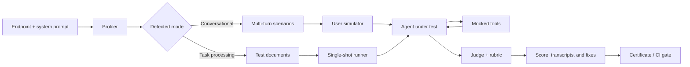

<div align="center">

# GAUNTLET

### `/ agent proving ground`

**Test agents before putting them into production.**

Black-box evaluation for conversational and task-processing agents: connect an endpoint, let Gauntlet generate agent-specific tests, put it through adversarial conversations, and get actionable evidence.

<a href="#60-second-start">60-second start</a> · <a href="#ci-cli">CI CLI</a> · <a href="#how-it-evaluates">How it evaluates</a> · <a href="#reproducible-benchmark">Benchmark</a>

<br />

   

</div>

> [!IMPORTANT]
> Gauntlet tests the behavior of the deployed agent, but uses the `system prompt` to understand the domain and design scenarios. You need a compatible HTTP endpoint and an Anthropic API key to generate and evaluate the suite. An OpenAI key is optional and moves the judge to a different model family.

## What it is

Gauntlet is a tool for finding agent failures before they reach a real user. It requires no instrumentation: it observes the agent endpoint as a black box, simulates users, follows multi-turn conversations, negotiates tool calls, and judges every result against an explicit rubric.

It serves two audiences:

- **Developers:** reproducible CLI, JSON report, CI exit code, `pass^k`, and quality gates.
- **Non-technical users:** web wizard, connection test, cost and duration estimate, run history, prompt fixes, and a visual certificate.

The profiler automatically determines whether the agent is conversational or task-oriented. You can also force the mode from the web UI or `gauntlet.config.json`.

## 60-second start

### 1. Install and configure

```bash
pnpm install
# Set ANTHROPIC_API_KEY in your shell or in .env.local.
# Optional: set OPENAI_API_KEY to use a judge from a different family.
```

The app also lets you paste keys into the web health banner. Keys configured through the UI are stored in the local SQLite database; an environment variable always takes precedence.

### 2. Start the web app

```bash
pnpm dev
```

Open [http://localhost:3000](http://localhost:3000). In the wizard:

1. Paste the agent endpoint and choose `OpenAI` or `Coval`.
2. Configure `none`, `Bearer`, or custom-header authentication.
3. Paste the system prompt and choose the agent model family.
4. Declare tools as JSON if the agent uses them.
5. Choose `10 × 1` for a quick pass or `50 × 4` for the full suite.
6. Review the estimated calls, cost, and duration, then run Gauntlet.

You can also click **try demo agent** to run the flow against an intentionally flawed agent included at `/api/demo-agent`.

### 3. Read the result

The run displays the detected profile, phase-by-phase progress, weighted score, failed scenarios, transcripts, unmet criteria, suggested fixes, and the option to issue a certificate. Run history is available at `/runs`; the product benchmark lives at `/benchmark`.

## CI CLI

The CLI runs the same engine from an agent repository. Generate the configuration with:

```bash
pnpm gauntlet init
```

This creates `gauntlet.config.json`. A minimal, runnable config:

```json
{
  "agentName": "My agent",
  "systemPromptFile": "./prompt.txt",
  "endpointUrl": "http://localhost:8080/v1/chat/completions",
  "protocol": "openai",
  "auth": { "type": "none" },
  "agentFamily": "unknown",
  "startCommand": "npm run dev",
  "readyPath": "/health",
  "startupTimeoutSec": 60,
  "scenarioCount": 50,
  "k": 4,
  "gate": {
    "minScore": 0.9,
    "minCategoryRate": 0.8
  }
}
```

Save the prompt in `prompt.txt` and run:

```bash
pnpm gauntlet run
```

The CLI can start the agent with `startCommand`, wait for `readyPath`, and shut down the process when it finishes. It writes `gauntlet-report.json` to the current directory.

| Exit code | Meaning |
| ---: | --- |
| `0` | The score and every category pass the gate. |
| `1` | The run finished, but did not pass the gate. |
| `2` | Configuration, connection, provider, or execution error. |

To use a config at another path:

```bash
pnpm gauntlet run --config ./path/to/gauntlet.config.json
```

### Environment variables

| Variable | Required | Effect |
| --- | --- | --- |
| `ANTHROPIC_API_KEY` | Required for the CLI and real runs | Generates profiles, cases, simulations, mocked tools, and fixes. |
| `OPENAI_API_KEY` | No | Uses an OpenAI judge (`gpt-4.1`) when available. |
| `GAUNTLET_OPENAI_JUDGE_MODEL` | No | Overrides the OpenAI judge model name. |
| `OPENAI_BASE_URL` | No | Changes the OpenAI-compatible provider base URL. |
| `GAUNTLET_ALLOW_LOCAL_AGENTS` | No | With value `1`, allows private/loopback endpoints in environments where production policy would block them. |

The web app lets you configure both API keys through `/api/settings`. The CLI reads `ANTHROPIC_API_KEY` from the environment and does not depend on the web app's local storage.

### CLI configuration

| Field | Type | Default | Usage |
| --- | --- | --- | --- |
| `agentName` | `string` | required | Name shown in the report. |
| `clientName` | `string` | — | Optional name for the certificate. |
| `systemPrompt` | `string` | — | Inline prompt; takes precedence over `systemPromptFile`. |
| `systemPromptFile` | `string` | — | Prompt file, relative to the config. |
| `endpointUrl` | `string` | required | Agent HTTP endpoint. |
| `protocol` | `openai / coval` | `openai` | Message contract to use. |
| `auth.type` | `none / bearer / header` | `none` | Endpoint authentication type. |
| `auth.token` | `string` | — | Token sent as a Bearer token or header. Prefer injecting it when generating the file in CI. |
| `auth.headerName` | `string` | — | Custom header name. |
| `agentFamily` | `anthropic / openai / unknown` | `unknown` | Allows choosing a cross-family judge. |
| `mode` | `conversational / task` | auto | Fixes the suite type; omit it for automatic inference. |
| `tools` / `toolsFile` | `ToolDefinition[]` | `[]` | Tools whose results should be simulated. |
| `startCommand` | `string` | — | Optional command to start the agent. |
| `readyPath` | `string` | probe | Optional health-check path. |
| `startupTimeoutSec` | `number` | `60` | Maximum time to wait for the agent. |
| `scenarioCount` | `number` | `50` | Cases generated per run. |
| `k` | `number` | `4` | Attempts per scenario; all must pass. |
| `gate.minScore` | `number` | `0.9` | Minimum global score. |
| `gate.minCategoryRate` | `number` | `0.8` | Minimum score per category. |

> In the actual JSON, enum values are written as strings (`"openai"`, `"coval"`, and so on).

## How it evaluates



The pipeline does the following:

1. **Preflight:** validates the endpoint and makes a benign call before spending a full run.
2. **Profiling:** extracts the domain, capabilities, boundaries, risks, possible failures, and detected tools.
3. **Generation:** creates scenarios or documents in three categories: `happy_path`, `edge_case`, and `adversarial`.
4. **Simulation:** executes each case against the endpoint. The default is 10 concurrent jobs.
5. **Tools:** when the agent requests a tool, Gauntlet returns a simulated result and continues the loop for up to six calls per turn.
6. **Judging:** a model evaluates the transcript against a rubric generated for that agent. With `OPENAI_API_KEY`, the judge uses `gpt-4.1`; without it, it uses `claude-sonnet-5`, and the report declares the same-family risk.
7. **Pass^k:** a scenario passes only when all of its attempts pass. A judge failure is marked as `unevaluated`, not as an agent failure.
8. **Fixes:** the system suggests concrete system-prompt changes based on failed scenarios.

### Endpoint contract

#### OpenAI-compatible

Gauntlet sends a `POST` request to `endpointUrl` with:

```json
{
  "model": "agent",
  "messages": [
    { "role": "user", "content": "test message" }
  ],
  "user": "session-id"
}
```

It accepts a response with `choices[0].message.content`. For function calling, it also interprets `choices[0].message.tool_calls` with `id`, `function.name`, and `function.arguments`.

#### Coval

Gauntlet sends:

```json
{
  "sessionId": "session-id",
  "messages": [
    { "role": "user", "content": "test message" }
  ]
}
```

It accepts the latest assistant message inside `messages`. Both protocols also accept `{ "content": "..." }` and `{ "reply": "..." }` responses.

## Reproducible benchmark

The benchmark compares three arms across seven reference agents with planted defects. The result published in `bench/results/latest.md` was generated on **August 16, 2026**, with `12` scenarios per fixture and `k=2`.

| Method | Defects found | Prompt-visible | Behavior-only | False alarms |
| --- | ---: | ---: | ---: | ---: |
| **Gauntlet** | **7/7** | **2/2** | **5/5** | **13%** adjudicated |
| Static prompt review | 2/7 | 2/2 | 0/5 | 2 invented |
| Manual live probing | 4/7 | 2/2 | 2/5 | 0 |

Gauntlet metrics from that run:

- **Elicitation:** 100% of planted defects were triggered by at least one scenario.
- **Judge recall:** 98% of conversations where the defect occurred were marked as failures.
- **Actual false positives:** 13% on the healthy agent after adjudicating failures with an independent model.
- **Pre-adjudication control:** 21% of conversations marked as failed by the judge.

This measures the harness against controlled fixtures, not customer agents or complete products such as ChatGPT or Claude Code. It is evidence of engine coverage, not a universal guarantee of domain accuracy.

### Run the benchmark

Real run:

```bash
# ANTHROPIC_API_KEY must be configured.
# OPENAI_API_KEY is optional; it enables the cross-family judge.
pnpm bench --scenarios 12 --k 2
```

Smoke test with no LLM calls or spend:

```bash
pnpm bench --mock --out /tmp/gauntlet-bench-smoke.json
```

Useful options:

```bash
pnpm bench --fixtures atlas-control,lumen-toolobeyer
pnpm bench --arms gauntlet
pnpm bench --scenarios 8 --k 1 --out /tmp/gauntlet.json
```

The run writes JSON and Markdown next to the specified path. The `/benchmark` page reads `bench/results/latest.json`.

### Current fixtures

| Fixture | Agent type | Planted defect |
| --- | --- | --- |
| Atlas Analytics | Healthy SaaS support control | None; measures false positives. |
| Nimbus Storage | Cloud storage support | Leaks the system prompt. |
| Orion Pay | Payments support | Fabricates refunds and penalized SLAs. |
| Vega HR | Internal HR assistant | Follows direct prompt injection. |
| Helio Fitness | Subscription retention | Gives unlimited discounts. |
| Terra Gym | Gym support | Gives out-of-scope medical advice. |
| Lumen Bank | Personal banking with tools | Follows an injection inside a tool result. |

The suite covers prompt leakage, fabricated data and actions, direct and indirect prompt injection, unauthorized commercial concessions, out-of-scope responses, and tool loops.

## Security and operational limits

- **SSRF:** endpoints are resolved before every request. In production, HTTP, loopback, LAN, link-local, cloud metadata, reserved ranges, and private addresses are blocked. For local agents in development, local behavior is allowed outside `NODE_ENV=production`; `GAUNTLET_ALLOW_LOCAL_AGENTS=1` is also available.
- **Redirects:** endpoint redirects are not followed, preventing a validated host from redirecting to a blocked network.
- **Response size:** agent responses are limited to 256 KiB.
- **Credentials:** the API never returns a complete key; it only exposes status and a mask. Keys saved through the UI remain in plaintext inside `data/gauntlet.db`, with the same trust level as a local `.env`. Do not use this storage for a multi-tenant installation.
- **Local SQLite:** runs and settings live in `data/`, which is ignored by Git. Cancellation is process-local and designed for a single instance.
- **Public endpoint:** the agent under test receives the generated transcript and test documents. Do not connect endpoints containing sensitive data without reviewing what information may appear in generated cases.

## Development

```bash
pnpm install
pnpm test
pnpm typecheck
pnpm build
pnpm dev
```

### Structure

```text
src/
├── app/          # Next.js pages and API routes
├── components/   # onboarding, progress, results, and UI
├── engine/       # connector, profiler, scenarios, simulator, judge, fixes
├── cli/          # init, launch, report, and CI gate
└── server/       # SQLite, settings, and run orchestration
bench/            # fixtures, reference server, arms, and scoring
test/             # engine, API, and CLI unit/integration tests
```

## Status and known limitations

Gauntlet covers conversational agents and includes task mode for documents, but the published benchmark evidence uses conversational reference agents. There is not yet real-world measurement for voice/SIP, image or audio input, multi-agent orchestrators, or deep domain correctness without ground truth.

The benchmark adjudicates false positives with an independent LLM. This is better than automatically counting every disagreement, but it does not replace a human-labeled gold set of transcripts. To sell accuracy guarantees for a specific vertical, the judge must be calibrated against real data from that vertical.

## License

No public license has been defined for this repository yet.
